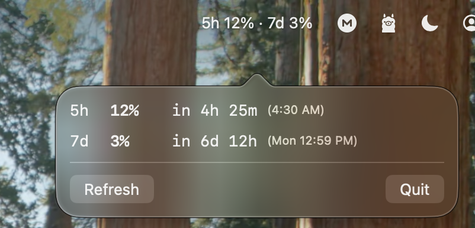

# claude-usage-extension

A tiny macOS menu bar app that shows your Claude 5-hour session and weekly usage at a glance.



## What it shows

- **Menu bar title**: `5h NN% · 7d NN%` — current session usage and weekly all-models usage, updated live.
- **Popover** (on click): both numbers plus the countdown to reset and the absolute reset time. Two buttons: **Refresh** and **Quit**.

That's it. No settings, no thresholds, no notifications, no Sonnet-only breakdown.

## How it works

The app reuses the OAuth token that the [Claude Code](https://claude.ai/code) CLI stores in your macOS Keychain (item `Claude Code-credentials`). It then calls the same undocumented endpoint that powers `claude.ai/settings/usage`:

```
GET https://api.anthropic.com/api/oauth/usage
Authorization: Bearer <oauth_token>
anthropic-beta: oauth-2025-04-20
```

The response includes a `five_hour` and `seven_day` section with `utilization` (0–100) and `resets_at` (ISO8601). The app parses those, redraws the menu bar, and schedules the next refresh.

- **Auto-refresh** every 10 minutes.
- **Manual refresh** via the button in the popover.
- **Backoff** to 15 minutes on HTTP 429; the cached token is dropped so the next attempt re-reads the keychain (in case Claude Code rotated it).

Because the token is already on your machine, there's no separate login step. If you're signed into Claude Code, this works.

> The `/api/oauth/usage` endpoint is undocumented and may change without notice.

## Requirements

- macOS 13+
- Xcode command-line tools (`xcode-select --install`)
- Claude Code installed and logged in

## Build

```bash
git clone https://github.com/rvthak/claude-usage-extension
cd claude-usage-extension
./build.sh
open ClaudeUsage.app
```

`build.sh` runs `swift build -c release` and wraps the binary into `ClaudeUsage.app` with a proper `Info.plist` (`LSUIElement = true`, so no Dock icon).

## One-time code-signing setup (recommended)

The app reads the `Claude Code-credentials` Keychain item. macOS records your **Always Allow** grant against the app's code signature, so the signature must be **stable**. If the app is ad-hoc signed, the grant doesn't stick — and because Claude Code rewrites the credential item every few hours when it rotates the OAuth token, macOS keeps re-prompting for your keychain password.

`build.sh` looks for a stable self-signed code-signing identity named `ClaudeUsage Code Signing`. Create it once from the terminal (no Keychain Access GUI needed):

```bash
# 1. Generate a self-signed code-signing key + cert
TMP="$(mktemp -d)"
openssl req -x509 -newkey rsa:2048 -keyout "$TMP/key.pem" -out "$TMP/cert.pem" \
  -days 3650 -nodes -subj "/CN=ClaudeUsage Code Signing" \
  -addext "basicConstraints=critical,CA:false" \
  -addext "keyUsage=critical,digitalSignature" \
  -addext "extendedKeyUsage=critical,codeSigning"

# 2. Bundle it into a PKCS#12 (any passphrase works; used only for the import below)
openssl pkcs12 -export -inkey "$TMP/key.pem" -in "$TMP/cert.pem" \
  -out "$TMP/identity.p12" -passout pass:claudeusage -legacy

# 3. Import into your login keychain, authorizing codesign to use the key
security import "$TMP/identity.p12" -k "$HOME/Library/Keychains/login.keychain-db" \
  -P claudeusage -T /usr/bin/codesign

# 4. Clean up the temporary key material
rm -rf "$TMP"
```

`security find-identity` will list it as `CSSMERR_TP_NOT_TRUSTED` — that's expected for a self-signed cert and doesn't affect signing. The cert is valid for 10 years and persists across rebuilds, so you only do this once.

Then (re)build so the app picks up the stable identity:

```bash
./build.sh   # prints "Signed with stable identity: ClaudeUsage Code Signing"
```

If you skip this step, `build.sh` falls back to ad-hoc signing and macOS will keep asking for your keychain password every few hours.

## First-launch keychain prompt

On first launch macOS will ask for your **login keychain password** (the same one you use to log in to your Mac) before allowing the app to read the `Claude Code-credentials` item. Click **Always Allow** so it doesn't reappear. With the stable code-signing identity above in place, that grant survives both rebuilds and Claude Code's periodic token rotations. If you click "Allow" once by mistake, open Keychain Access, find `Claude Code-credentials`, and add `ClaudeUsage.app` to its Access Control list.

## Project layout

```
Package.swift                       Swift Package manifest
Sources/ClaudeUsage/
  main.swift                        NSApplication bootstrap
  AppDelegate.swift                 NSStatusItem + popover + refresh timer
  UsageService.swift                Keychain read + API call + JSON decode
  PopoverView.swift                 SwiftUI popover (rows + buttons)
Resources/Info.plist                LSUIElement bundle metadata
build.sh                            Compile + package as .app
```

## License

MIT.
